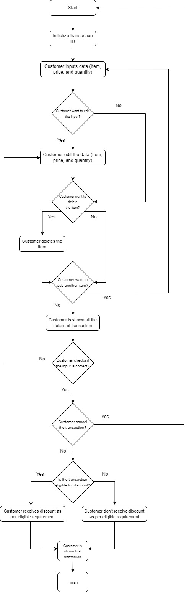

# Latar Belakang
Program ini dibuat dengan menggunakan bahasa python yang diperuntukkan sebagai aplikasi kasir sederhana yang datanya terdiri dari nama item, harga item, dan jumlah item dengan fitur-fiturnya adalah sebagai berikut:  
<ol>
  <li>Membuat ID transaksi</li>
  <li>Menambahkan data barang yang dibeli beserta jumlah dan total harganya</li>
  <li>Mengubah data barang yang dibeli beserta jumlah dan total harganya</li>
  <li>Menghapus data dari salah satu barang yang sudah diinput</li>
   <li>Menghapus seluruh data yang sudah diinput</li>
  <li>Mengecek data</li>
   <li>Menghitung total diskon</li>
  <li>Menghitung total transaksi</li>
   <li>Menampilkan seluruh informasi transaksi</li>
</ol> 

# Requirement
<ul>
    <li>Alur Program/Flowchart</li>
    <li>Fungsi</li>
</ul> 

# Snippet 

# Flowchart

# Test Case Result (Output)

